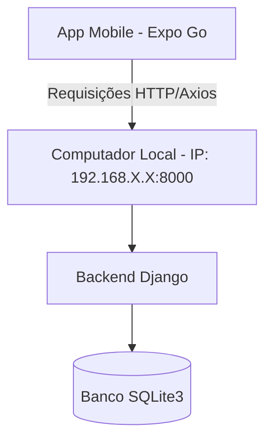

# 🎵 Guia de Configuração e Integração: SGOEM & ABANFAR-BF

Esta documentação serve como um guia passo a passo completo para configurar, rodar e integrar os dois repositórios do projeto:
1. **Backend (Web & API)**: Desenvolvido em **Django (Python)**, localizado na pasta `abanfar-bf`.
2. **Frontend (Mobile)**: Desenvolvido em **React Native + Expo**, localizado na pasta `abanfar-app4`.

---

## 📐 Arquitetura da Integração

A integração entre os sistemas funciona da seguinte forma:
- O **Backend Django** gerencia as regras de negócio, persistência de dados no banco SQLite3 e expõe endpoints REST.
- O **App Mobile** consome esses endpoints via requisições HTTP (usando a biblioteca `axios`).
- Para que o celular e o computador se comuniquem localmente durante o desenvolvimento, ambos **devem estar conectados na mesma rede Wi-Fi**.



---

## ⚙️ Pré-requisitos Gerais

Antes de iniciar, certifique-se de instalar:
1. **Node.js (v18 ou superior)**: Necessário para rodar o Expo. [Download LTS](https://nodejs.org).
2. **Python (3.10 ou superior)**: Necessário para rodar o Django. [Download](https://python.org) (*Marque a opção "Add Python to PATH" durante a instalação*).
3. **Git**: Para controle de versão. [Download](https://git-scm.com).
4. **Expo Go (no Celular)**: Baixe na Google Play Store (Android) ou Apple App Store (iOS).

> ⚠️ **IMPORTANTE**: O seu computador e o seu celular devem estar conectados ao **mesmo roteador/Wi-Fi**.

---

## 1️⃣ Configurando o Backend (Django)

Siga os passos abaixo no terminal (PowerShell, Command Prompt ou Terminal do VS Code) posicionado na pasta do backend (`c:\Users\jadso\Documents\abanfar-bf`):

### Passo 1: Criar e ativar o ambiente virtual (venv)
O ambiente virtual isola as bibliotecas Python do projeto.
```bash
# Criar o ambiente virtual (se ainda não existir)
python -m venv venv

# Ativar no Windows (Prompt de Comando ou PowerShell)
venv\Scripts\activate

# Ativar no macOS ou Linux
source venv/bin/activate
```
*Após ativar, você verá o prefixo `(venv)` no início da linha de comando.*

### Passo 2: Instalar as dependências do Python
```bash
pip install -r requirements.txt
```

### Passo 3: Executar as migrações (criar banco de dados)
Este comando cria o arquivo `db.sqlite3` com todas as tabelas necessárias:
```bash
python manage.py migrate
```

### Passo 4: Criar um Usuário Administrador (Superuser)
Este usuário será utilizado para fazer o login no painel administrativo do Django e no aplicativo mobile:
```bash
python manage.py createsuperuser
```
*Siga as instruções na tela informando **nome de usuário**, **e-mail** (pode deixar em branco e dar Enter) e **senha** (a senha não aparece ao digitar por segurança, basta digitar e dar Enter).*

### Passo 5: Descobrir o endereço de IP do seu Computador
O app precisa saber o IP do computador para enviar os dados.
- **No Windows**:
  Abra um terminal e digite:
  ```cmd
  ipconfig
  ```
  Procure por "Adaptador Ethernet" ou "Adaptador Rede Sem Fio Wi-Fi" e localize a linha **Endereço IPv4**. Exemplo: `192.168.3.103`.
- **No macOS / Linux**:
  Abra o terminal e digite:
  ```bash
  ifconfig
  ```
  Ou:
  ```bash
  ip a
  ```
  Procure pelo IP da sua interface de rede ativa (gereralmente começa com `192.168.X.X` ou `10.0.X.X`).

### Passo 6: Iniciar o Servidor Django
Inicie o Django permitindo conexões externas vinculando o servidor ao IP `0.0.0.0`:
```bash
python manage.py runserver 0.0.0.0:8000
```
*Isso fará o Django ouvir tanto requisições do `localhost` quanto requisições vindas do celular pela rede local.*

---

## 2️⃣ Configurando o Frontend (React Native / Expo)

Agora, abra outro terminal posicionado na pasta do aplicativo mobile (`c:\Users\jadso\Documents\abanfar-app4`):

### Passo 1: Instalar as dependências do Node.js
Utilize o parâmetro `--legacy-peer-deps` caso haja conflitos de versão do React:
```bash
npm install --legacy-peer-deps
```

### Passo 2: Integrar a API com o IP correto
Para que o app converse com o backend, edite o arquivo central de configuração da API:
1. Abra o arquivo [apiConfig.js](file:///c:/Users/jadso/Documents/abanfar-app4/apiConfig.js) no VS Code.
2. Substitua o endereço de IP pelo **IP do seu computador** (descoberto no Passo 5 do Backend):

```javascript
// c:\Users\jadso\Documents\abanfar-app4\apiConfig.js
export const API_BASE = 'http://192.168.3.103:8000'; // ← Altere para o IP do seu computador
```

> 💡 **Nota**: O aplicativo está projetado para ler centralizadamente a constante `API_BASE` em todas as telas (Login, Instrumentos, Ensaios, Painel e Scanner), portanto, basta alterar este único arquivo.

### Passo 3: Iniciar o servidor do Expo
Rode o comando para subir o servidor do Metro Bundler:
```bash
npx expo start
```
*O terminal exibirá um **QR Code** de tamanho grande.*

---

## 3️⃣ Executando no Celular e Testando a Integração

1. Certifique-se de que o celular está conectado no **mesmo Wi-Fi** do computador.
2. Abra o aplicativo **Expo Go** no celular.
3. Escaneie o QR Code:
   - **No Android**: Use o botão "Scan QR Code" dentro do próprio app Expo Go.
   - **No iOS (iPhone)**: Abra o aplicativo nativo da Câmera e aponte para o QR Code.
4. Aguarde a barra de carregamento atingir 100%. O app abrirá na tela de Login.
5. Digite as credenciais do **Superusuário** criadas anteriormente no Django.
6. Toque em **Entrar**. O app salvará a sessão no armazenamento local (`AsyncStorage`) e o redirecionará para a tela principal (Dashboard / Scanner)!

---

## 🚨 Resolução de Problemas Comuns (Troubleshooting)

### 1. O aplicativo não consegue se conectar ao servidor (Erro: `Network Error` ou `ERR_NETWORK`)
- **Verifique o Wi-Fi**: Garanta que o celular não está utilizando a rede de dados móveis (3G/4G/5G).
- **Verifique o IP**: Certifique-se de que o IP em `apiConfig.js` é exatamente o IP local atual do computador (IPs dinâmicos podem mudar ao reiniciar o roteador).
- **Verifique o comando de execução**: O Django foi iniciado com `0.0.0.0:8000`? Se iniciar apenas com `runserver`, ele bloqueará conexões de dispositivos externos.
- **Firewall do Windows**: O Firewall do Windows pode estar bloqueando a porta `8000`. Desative-o temporariamente para testes ou crie uma regra de entrada para liberar a porta `8000`.

### 2. Rede corporativa ou de instituição de ensino bloqueia conexões locais (Isolamento de AP)
Algumas redes públicas ou acadêmicas impedem que dispositivos conectados no mesmo Wi-Fi se comuniquem por segurança. Se este for o caso, use a funcionalidade de **túnel (Tunneling)** do Expo:
1. Pare o servidor do Expo no terminal (`Ctrl + C`).
2. Inicie o Expo com o parâmetro de túnel (que usa o Ngrok sob o capô):
   ```bash
   npx expo start --tunnel
   ```
3. Escaneie o novo QR Code gerado. O tráfego passará pela internet de forma segura, contornando o bloqueio local.

### 3. Erro de execução de scripts no PowerShell (Windows)
Se ao rodar `venv\Scripts\activate` ocorrer um erro de permissão do PowerShell, abra o PowerShell como **Administrador** e execute:
```powershell
Set-ExecutionPolicy -ExecutionPolicy RemoteSigned -Scope LocalMachine
```
E tente ativar o ambiente novamente.
